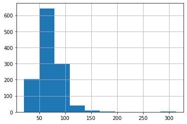

# Core steps to start a typical machine learning problem

Welcome to my first post! 

I have been taking almost all of the kaggle courses in the past several weeks, and I have learned quite a lot from them. While I am already familiar with most of the basic machine learning algorithms, there are plenty of useful packages that I haven't been taking advantage of, and there are some good rule of thumbs that I didn't know. The purpose of this notebook is to document useful code sbnippets I learned from these courses, and hopefully they can be reused in my future data science projects!

This is also a good practice for me to learn Markdown and host Jupyter notebooks.

## Example dataset: predicting house prices 

I am going to use the tutorial [housing prices prediction dataset](https://www.kaggle.com/c/home-data-for-ml-course) from Kaggle. We will try to predict the house prices based on some features such as number of rooms and house area. Let's first load the data in:


```python
# load in the dataset
import os
import pandas as pd
import numpy as np
from sklearn.model_selection import train_test_split 

dataset_path = "../datasets/house_prices_prediction/"

X_full = pd.read_csv(os.path.join(dataset_path, 'train.csv'), index_col='Id')
X_test_full = pd.read_csv(os.path.join(dataset_path, 'test.csv'), index_col='Id')
print('Train dataset has {} data points with {} columns'.format(X_full.shape[0], X_full.shape[1]))

# Remove rows with missing y (house price) and separate dataset into X and y
X_full.dropna(axis=0, subset=['SalePrice'], inplace=True)
y = X_full.SalePrice
X_full.drop(['SalePrice'], axis=1, inplace=True)
print('\nRemove Rows with missing y')
print('Train dataset now has {} data points with {} columns'.format(X_full.shape[0], X_full.shape[1]))


```

    Train dataset has 1460 data points with 80 columns
    
    Remove Rows with missing y
    Train dataset now has 1460 data points with 79 columns


### Data cleaning: deal with missing values

We should always inspect the data first with the *head()* or *describe()* function. Specifically, we should watch out for missing entries, as most ML algorithms except random forest aren't designed to handle them.

We should output the name of the columns with missing entries


```python
# always try to get an idea of the data you are working with!
#print(X_full.head())
#print(X_full.describe())

# look for columns with missing entries
NA_column_names = X_full.isnull().sum().sort_values(ascending=False)
NA_column_names = NA_column_names[NA_column_names > 0]
print('Columns with NA entries: ')
print(NA_column_names)
```

    Columns with NA entries: 
    PoolQC          1453
    MiscFeature     1406
    Alley           1369
    Fence           1179
    FireplaceQu      690
    LotFrontage      259
    GarageCond        81
    GarageType        81
    GarageYrBlt       81
    GarageFinish      81
    GarageQual        81
    BsmtExposure      38
    BsmtFinType2      38
    BsmtFinType1      37
    BsmtCond          37
    BsmtQual          37
    MasVnrArea         8
    MasVnrType         8
    Electrical         1
    dtype: int64


There are several columns with missing entries. Columns with few missing entries such as *Electrical* can usually be dropped directly. For the other columns, we should look into the data description to see why there are missing values.

Are they simply not recorded, or are they left blank for obvious reasons? 

How should we deal with these columns?
1. We can simply drop the column
2. We can use an imputer to replace NA values with mean, median etc...
3. We can use an imputer plus adding feature columns to denote the imputed entries


```python
X_full.columns
```


    Index(['MSSubClass', 'MSZoning', 'LotFrontage', 'LotArea', 'Street', 'Alley',
           'LotShape', 'LandContour', 'Utilities', 'LotConfig', 'LandSlope',
           'Neighborhood', 'Condition1', 'Condition2', 'BldgType', 'HouseStyle',
           'OverallQual', 'OverallCond', 'YearBuilt', 'YearRemodAdd', 'RoofStyle',
           'RoofMatl', 'Exterior1st', 'Exterior2nd', 'MasVnrType', 'MasVnrArea',
           'ExterQual', 'ExterCond', 'Foundation', 'BsmtQual', 'BsmtCond',
           'BsmtExposure', 'BsmtFinType1', 'BsmtFinSF1', 'BsmtFinType2',
           'BsmtFinSF2', 'BsmtUnfSF', 'TotalBsmtSF', 'Heating', 'HeatingQC',
           'CentralAir', 'Electrical', '1stFlrSF', '2ndFlrSF', 'LowQualFinSF',
           'GrLivArea', 'BsmtFullBath', 'BsmtHalfBath', 'FullBath', 'HalfBath',
           'BedroomAbvGr', 'KitchenAbvGr', 'KitchenQual', 'TotRmsAbvGrd',
           'Functional', 'Fireplaces', 'FireplaceQu', 'GarageType', 'GarageYrBlt',
           'GarageFinish', 'GarageCars', 'GarageArea', 'GarageQual', 'GarageCond',
           'PavedDrive', 'WoodDeckSF', 'OpenPorchSF', 'EnclosedPorch', '3SsnPorch',
           'ScreenPorch', 'PoolArea', 'PoolQC', 'Fence', 'MiscFeature', 'MiscVal',
           'MoSold', 'YrSold', 'SaleType', 'SaleCondition'],
          dtype='object')


```python
idx = 2
colname = X_full.columns[idx]
print('column {} has {} NA entries'.format(colname, X_full[colname].isna().sum()))
print(X_full[colname].describe())
X_full[colname].hist(bins=10)
```

    column LotFrontage has 259 NA entries
    count    1201.000000
    mean       70.049958
    std        24.284752
    min        21.000000
    25%        59.000000
    50%        69.000000
    75%        80.000000
    max       313.000000
    Name: LotFrontage, dtype: float64


    <AxesSubplot:>


    

    


```python
# Perform various actions on theses columns with missing entries 
from sklearn.preprocessing import OrdinalEncoder, OneHotEncoder, StandardScaler
from sklearn.pipeline import Pipeline, make_pipeline
from sklearn.impute import SimpleImputer
from sklearn.compose import make_column_transformer

X = X_full.copy()

y = np.log1p(y) # looks more Gaussian-like

# 1. There are only several houses with MiscFeature, and MiscVal stores there value
#    All possible values are ['Elev', 'Gar2', 'Othr', 'Shed', 'TenC']
#    Most are just 'Shed'
#    I will create a column ShedArea to record MiscVal for Shed, and throw away column MiscFeature and MiscVal
isShed = X.MiscFeature == 'Shed'
X.loc[isShed, 'MiscVal'] = 0.0
X.rename(columns={'MiscVal': 'ShedArea'}, inplace=True)
X.drop(columns=['MiscFeature'], inplace=True)

# 2. Alley: only Grvl or Pave alley
#    use two one-hot columns (GrvlAlley, PaveAlley) here and drop Alley
X['isGrvlAlley'] = pd.Series(X.Alley == 'Grvl', index=X.index, dtype=float)
X['isPavedAlley'] = pd.Series(X.Alley == 'Pave', index=X.index, dtype=float)
X.drop(columns=['Alley'], inplace=True)

# 3. Fence: good/minimum privacy, good/minimum wood
#    column FencePrivacy: [2, 1, 0] for [good/minimum/NA]
#    column FenceWood: [2, 1, 0] for [good/minimum/NA]
X['FencePrivacy'] = X.Fence.map({'GdPrv': 2.0, 'MnPrv': 1.0, 'GdWo': 0.0, 'MnWw': 0.0, np.nan: 0.0})
X['FenceWood'] = X.Fence.map({'GdPrv': 0.0, 'MnPrv': 0.0, 'GdWo': 2.0, 'MnWw': 1.0, np.nan: 0.0})
X.drop(columns=['Fence'], inplace=True)

# 4. LotFrontage: replace with 0 or average?

# 5. Garage columns
#    replace NA entries in GarageYrBlt with the oldest year
X.GarageYrBlt.fillna(1900.00, inplace=True)


# 6. MasVnr columns
#    should change NA entries in MasVnrType to 'None'
#    should change NA entries in MasVnrArea to 0.0

X.MasVnrType.fillna('None', inplace=True)
X.MasVnrArea.fillna(0.0, inplace=True)

# 7. Electrical columns
#    only one missing entry: throw this row away!
y = y[X.Electrical.notna()]
X = X[X.Electrical.notna()]

# 8. CentralAir column:
X.CentralAir = X.CentralAir.map({'N': 0.0, 'Y': 1.0})

# For the rest of the columns, we apply the default pipeline
one_hot_cols = ['MSZoning', 'LotConfig', 'BldgType', 'HouseStyle', 'RoofStyle', 'RoofMatl', 
                'Foundation', 'Heating', 'MasVnrType', 'GarageType']
#ordinal_cols = ['Street', 'LotShape', 'LandContour', 'Utilities', 
#                'LandSlope', 'ExterQual', 'ExterCond', 'HeatingQC', 'Electrical', 'KitchenQual', 'Functional', 
#                'PavedDrive', 'PoolQC', 'FireplaceQu', 'GarageQual', 'GarageCond', 'GarageFinish', 
#                'BsmtQual', 'BsmtCond', 'BsmtExposure']
too_many_entries_cols = ['Neighborhood', 'Condition1', 'Condition2', 'Exterior1st', 'Exterior2nd', 
                         'SaleType', 'SaleCondition']
X.drop(columns=too_many_entries_cols, inplace=True)

num_cols = X.columns[(X.dtypes == 'float64') | (X.dtypes == 'int64')]

categories_onehot = [
    X[column].unique() for column in X[one_hot_cols]]

for cat in categories_onehot:
    cat[cat == np.nan] = 'missing'  # replace NA entries with 'missing'
    
def cat_proc_ordinal(categories, num_cols):
    """Create preprocessing pipeline for ordinal category variables. takes list-like categories"""
    return make_pipeline(
        SimpleImputer(missing_values=np.nan, strategy='constant',
            fill_value='Missing'),
        OrdinalEncoder(categories=[np.array(categories)] * num_cols, dtype=np.float)
        )

cat_proc_onehot = make_pipeline(
    SimpleImputer(missing_values=np.nan,
                  strategy='constant',
                  fill_value='Missing'),
    OneHotEncoder(dtype=np.float, handle_unknown='ignore')
)

num_proc = make_pipeline(
    SimpleImputer(strategy='mean'),
    StandardScaler()
)

# deal with ordinal columns separately
preprocessor = make_column_transformer(
    (cat_proc_ordinal(['Grvl', 'Pave'], 1), ['Street']),
    (cat_proc_ordinal(['IR3', 'IR2', 'IR1', 'Reg'], 1), ['LotShape']),
    (cat_proc_ordinal(['Low', 'HLS', 'Bnk', 'Lvl'], 1), ['LandContour']),
    (cat_proc_ordinal(['ELO', 'NoSeWa', 'NoSeWr', 'AllPub'], 1), ['Utilities']),
    (cat_proc_ordinal(['Sev', 'Mod', 'Gtl'], 1), ['LandSlope']),
    (cat_proc_ordinal(['FuseP', 'FuseF', 'FuseA', 'Mix', 'SBrkr'], 1), ['Electrical']),
    (cat_proc_ordinal(['Sal', 'Sev', 'Maj2', 'Maj1', 'Mod', 'Min2', 'Min1', 'Typ'], 1), ['Functional']),
    (cat_proc_ordinal(['N', 'P', 'Y'], 1), ['PavedDrive']),
    (cat_proc_ordinal(['Missing', 'Unf', 'RFn', 'Fin'], 1), ['GarageFinish']),
    (cat_proc_ordinal(['Missing', 'Unf', 'LwQ', 'Rec', 'BLQ', 'ALQ', 'GLQ'], 2), ['BsmtFinType1', 'BsmtFinType2']),
    (cat_proc_ordinal(['Po', 'Fa', 'TA', 'Gd', 'Ex'], 4), 
         ['ExterQual', 'ExterCond', 'HeatingQC', 'KitchenQual']),
    (cat_proc_ordinal(['Missing', 'Po', 'Fa', 'TA', 'Gd', 'Ex'], 5), 
         ['FireplaceQu', 'GarageQual', 'GarageCond', 'BsmtQual', 'BsmtCond']),
    (cat_proc_ordinal(['Missing', 'Fa', 'TA', 'Gd', 'Ex'], 1), ['PoolQC']),
    (cat_proc_ordinal(['Missing', 'No', 'Mn', 'Av', 'Gd'], 1), ['BsmtExposure']),
    (cat_proc_onehot, one_hot_cols),
    (num_proc, num_cols),
    remainder='passthrough')

```

### Cut dataset into training and validation set and start training


```python
from sklearn.experimental import enable_hist_gradient_boosting  # noqa
from sklearn.ensemble import HistGradientBoostingRegressor
from sklearn.ensemble import RandomForestRegressor
from sklearn.ensemble import StackingRegressor
from sklearn.linear_model import LassoCV
from sklearn.linear_model import RidgeCV
from sklearn.metrics import mean_absolute_error
from sklearn.model_selection import GridSearchCV
import xgboost as xgb
from xgboost import XGBRegressor

X_train, X_valid, y_train, y_valid = train_test_split(X, y, train_size=0.8, test_size=0.2,
                                                      random_state=0)

# I will compare a random forest model to a xgboost model
#X_train_transformed = preprocessor.fit_transform(X_train)
#X_valid_transformed = preprocessor.transform(X_valid)
xgb_model = XGBRegressor(n_estimators=700, learning_rate=0.02)
xgb_clf = GridSearchCV(xgb_model, {'max_depth': [2, 4, 6],
                                  'n_estimators': [100, 200, 300],
                                  'learning_rate': [0.01, 0.03, 0.05],
                                  'gamma': np.logspace(-5, 2, 5),
                                  'reg_lambda': np.logspace(-2, 0, 3)}, verbose=1,
                       n_jobs=2, cv=5, scoring='neg_mean_absolute_error')
xgb_clf.fit(preprocessor.fit_transform(X), y)

# TODO: try DART booster

print('MAE trained with xg model: ', xgb_clf.best_score_)
print('best xg model parameters: ', xgb_clf.best_params_)

rf_pipeline = Pipeline(steps=[('preprocessor', preprocessor),
                              ('model', RandomForestRegressor(random_state=0))])
rf_pipeline.fit(X_train, y_train)
y_pred_rf = rf_pipeline.predict(X_valid)

# Evaluate the model
score = mean_absolute_error(y_valid, y_pred_rf)
print('MAE trained with rf model:', score)

#estimators = [('Random Forest', rf_pipeline),
#              ('Lasso', lasso_pipeline),
#              ('Gradient Boosting', gradient_pipeline)]

#stacking_regressor = StackingRegressor(estimators=estimators,
#                                       final_estimator=RidgeCV())
```

    Fitting 5 folds for each of 405 candidates, totalling 2025 fits


    [Parallel(n_jobs=2)]: Using backend LokyBackend with 2 concurrent workers.


    ---------------------------------------------------------------------------

    KeyboardInterrupt                         Traceback (most recent call last)

    <ipython-input-7-0f5a3ca916a4> in <module>
         23                                   'reg_lambda': np.logspace(-2, 0, 3)}, verbose=1,
         24                        n_jobs=2, cv=5, scoring='neg_mean_absolute_error')
    ---> 25 xgb_clf.fit(preprocessor.fit_transform(X), y)
         26 
         27 # TODO: try DART booster


    /opt/anaconda3/envs/kaggle/lib/python3.8/site-packages/sklearn/utils/validation.py in inner_f(*args, **kwargs)
         70                           FutureWarning)
         71         kwargs.update({k: arg for k, arg in zip(sig.parameters, args)})
    ---> 72         return f(**kwargs)
         73     return inner_f
         74 


    /opt/anaconda3/envs/kaggle/lib/python3.8/site-packages/sklearn/model_selection/_search.py in fit(self, X, y, groups, **fit_params)
        734                 return results
        735 
    --> 736             self._run_search(evaluate_candidates)
        737 
        738         # For multi-metric evaluation, store the best_index_, best_params_ and


    /opt/anaconda3/envs/kaggle/lib/python3.8/site-packages/sklearn/model_selection/_search.py in _run_search(self, evaluate_candidates)
       1186     def _run_search(self, evaluate_candidates):
       1187         """Search all candidates in param_grid"""
    -> 1188         evaluate_candidates(ParameterGrid(self.param_grid))
       1189 
       1190 


    /opt/anaconda3/envs/kaggle/lib/python3.8/site-packages/sklearn/model_selection/_search.py in evaluate_candidates(candidate_params)
        706                               n_splits, n_candidates, n_candidates * n_splits))
        707 
    --> 708                 out = parallel(delayed(_fit_and_score)(clone(base_estimator),
        709                                                        X, y,
        710                                                        train=train, test=test,


    /opt/anaconda3/envs/kaggle/lib/python3.8/site-packages/joblib/parallel.py in __call__(self, iterable)
       1040 
       1041             with self._backend.retrieval_context():
    -> 1042                 self.retrieve()
       1043             # Make sure that we get a last message telling us we are done
       1044             elapsed_time = time.time() - self._start_time


    /opt/anaconda3/envs/kaggle/lib/python3.8/site-packages/joblib/parallel.py in retrieve(self)
        919             try:
        920                 if getattr(self._backend, 'supports_timeout', False):
    --> 921                     self._output.extend(job.get(timeout=self.timeout))
        922                 else:
        923                     self._output.extend(job.get())


    /opt/anaconda3/envs/kaggle/lib/python3.8/site-packages/joblib/_parallel_backends.py in wrap_future_result(future, timeout)
        540         AsyncResults.get from multiprocessing."""
        541         try:
    --> 542             return future.result(timeout=timeout)
        543         except CfTimeoutError as e:
        544             raise TimeoutError from e


    /opt/anaconda3/envs/kaggle/lib/python3.8/concurrent/futures/_base.py in result(self, timeout)
        432                 return self.__get_result()
        433 
    --> 434             self._condition.wait(timeout)
        435 
        436             if self._state in [CANCELLED, CANCELLED_AND_NOTIFIED]:


    /opt/anaconda3/envs/kaggle/lib/python3.8/threading.py in wait(self, timeout)
        300         try:    # restore state no matter what (e.g., KeyboardInterrupt)
        301             if timeout is None:
    --> 302                 waiter.acquire()
        303                 gotit = True
        304             else:


    KeyboardInterrupt: 


### Transform categorical features into numerical ones


### Generate submission.csv


```python
# remember to apply np.exp1m to get back normal sale price!
```
